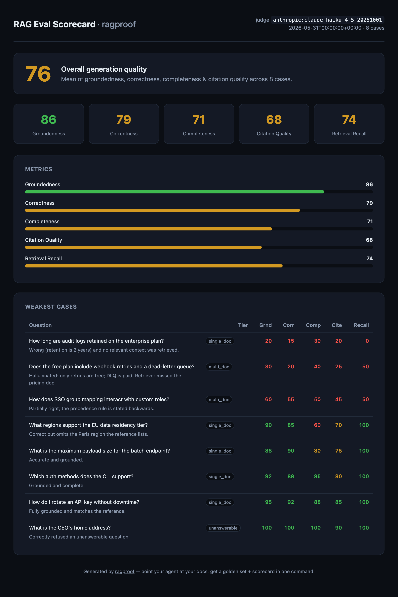
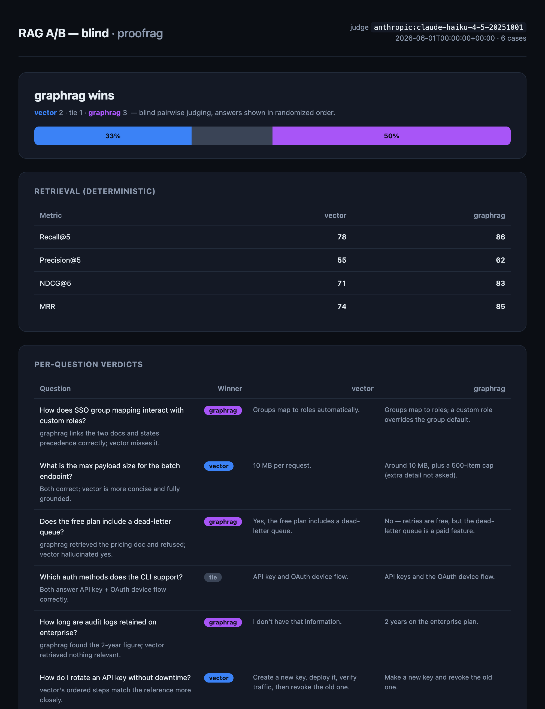

# proofrag

<p align="center">
  <a href="https://pypi.org/project/proofrag/"></a>
  <a href="https://pypi.org/project/proofrag/"></a>
  <a href="https://github.com/unshDee/proofrag/actions/workflows/ci.yml"></a>
  <a href="https://pepy.tech/project/proofrag"></a>
  <a href="LICENSE"></a>
</p>

**Point your agent at your docs and your RAG app. Get a golden test set, an
LLM-as-judge + retrieval scorecard, and a CI gate — in one command.**

Evaluation is the #1 unmet pain in production RAG/LLM work, and the hardest part
is building a good test set in the first place. `proofrag` generates one from
*your own corpus*, judges your system on it, and emits a shareable HTML scorecard.
It's an [Agent Skill](https://agentskills.io) (works in Claude Code, Codex, Cursor)
**and** a plain Python CLI — wrapping the eval loop, not reinventing the metrics.

<p align="center">
  
</p>

<p align="center"><em>…and the scorecard it produces:</em></p>
<p align="center">
  
</p>

<p align="center"><em>See a scorecard in 5 seconds — no API key needed:</em></p>

```bash
pipx install "proofrag[anthropic]"        # or: pip install / uv tool install / uvx
proofrag demo --out scorecard.html && open scorecard.html
```

> Use `[openai]` instead of `[anthropic]` for an OpenAI-compatible or local (Ollama) backend.
> No install? Run it ad-hoc: `uvx "proofrag[anthropic]" demo`.

## Install as an Agent Skill

`proofrag` is a skill (the [agentskills.io](https://agentskills.io) open standard) backed
by a real CLI — so any agent can run *"evaluate my RAG"* and get a reproducible scorecard.

**Claude Code (plugin):**
```
/plugin marketplace add unshDee/proofrag
/plugin install proofrag@proofrag
```
Then ask *"evaluate my RAG"* (auto-triggered) or type `/proofrag`.

**Claude Code (manual)** — `cp -r skills/proofrag ~/.claude/skills/`
**Codex / other agents** — `cp -r skills/proofrag .agents/skills/`

The skill drives the `proofrag` CLI; install it with `uv tool install "proofrag[anthropic]"`
(or `pipx install`, or run ad-hoc via `uvx`). See [AGENTS.md](AGENTS.md) for details.

## Why this exists

> "Running evals aren't the problem — the problem is acquiring or building a
> high-quality, non-contaminated dataset."

Most RAG systems reach production with no evals because writing a balanced golden
set by hand is tedious. So teams ship prompt and model changes blind. This closes
that loop: **change something → re-run → see if quality moved → gate the merge.**

## The loop

```bash
# 1. Generate a golden set from YOUR docs (questions + gold answers + gold contexts)
proofrag generate --corpus ./docs --out goldenset.jsonl --n 20

# 2. Run your RAG over each question -> predictions.jsonl  (one line per question)
#    {"id": "q000", "answer": "...", "retrieved_contexts": ["...", "..."]}
#    See examples/docs-rag/naive_rag.py for a runnable driver.

# 3. Judge: groundedness, correctness, completeness, citation quality + retrieval metrics
proofrag evaluate --goldenset goldenset.jsonl --predictions predictions.jsonl --out results.json

# 4. Shareable HTML scorecard
proofrag report --results results.json --out scorecard.html
```

Run the whole thing end-to-end against the bundled example:

```bash
uv sync --extra anthropic && export ANTHROPIC_API_KEY=...
uv run proofrag generate --corpus examples/docs-rag/corpus --out goldenset.jsonl --n 8
uv run python examples/docs-rag/naive_rag.py --goldenset goldenset.jsonl --corpus examples/docs-rag/corpus --out predictions.jsonl
uv run proofrag evaluate --goldenset goldenset.jsonl --predictions predictions.jsonl --out results.json
uv run proofrag report --results results.json --out scorecard.html
```

## CI gate

Two kinds of gate. An **absolute** floor:

```bash
proofrag evaluate --goldenset goldenset.jsonl --predictions predictions.jsonl \
  --out results.json --fail-under 0.7      # non-zero exit if overall score drops below 0.7
```

…and a **regression** gate against a committed baseline (a known-good results.json):

```bash
proofrag diff --baseline baseline.json --candidate results.json --tolerance 0.02
# prints a per-metric delta table; exits 1 if any metric dropped > tolerance.
# Refuses to compare across different judge models unless --allow-judge-mismatch.
```

### GitHub Action

Drop proofrag into any repo's CI in a few lines — it installs the CLI, evaluates,
writes the scorecard, and gates on both the floor and the baseline:

```yaml
- uses: unshDee/proofrag@v0
  env:
    ANTHROPIC_API_KEY: ${{ secrets.ANTHROPIC_API_KEY }}
  with:
    goldenset: eval/goldenset.jsonl
    predictions: predictions.jsonl     # produced by your RAG earlier in the job
    baseline: eval/baseline.json        # optional regression gate
    fail-under: "0.7"                   # optional absolute gate
```

Full runnable workflow (with artifact upload): [`examples/ci/proofrag-eval.yml`](examples/ci/proofrag-eval.yml).

## A/B: compare two RAG variants

Vector vs GraphRAG? Two prompts? Two models? Run both over the **same** golden set,
then let the **same** judge pick the better answer per question — **blind** (answers
shown in randomized order, so position bias is shuffled out):

```bash
proofrag compare --goldenset goldenset.jsonl \
  --a vector_preds.jsonl  --a-name vector \
  --b graphrag_preds.jsonl --b-name graphrag \
  --out comparison.json --html comparison.html
```

<p align="center">
  
</p>

Deterministic retrieval metrics for each variant sit beside the verdict, so you can
tell whether a win came from better retrieval or better generation.

## What makes it different

- **Golden set from your corpus** — the wedge. Difficulty tiers: single-doc,
  multi-doc, and *unanswerable* (so you catch hallucination-instead-of-refusal).
- **Retriever vs generator split** — rank-aware retrieval metrics (Recall@k,
  Precision@k, NDCG@k, MRR) separate "the context never arrived / ranked too low"
  from "the model fluffed it." Lexical by default; `--semantic` for embedding match.
- **Pinned, fingerprinted judge** — every scorecard records its judge model, so you
  never compare scores produced by different judges.
- **Cheap & portable** — defaults to a small model; Anthropic, OpenAI, or local/Ollama
  (`OPENAI_BASE_URL`). Self-contained HTML, zero JS, zero external assets.
- **Agent-native** — drop it in as a skill and say *"evaluate my RAG"*; the agent
  wires your pipeline to the kit.

## Configuration

| Env | Default | Purpose |
|-----|---------|---------|
| `ANTHROPIC_API_KEY` | — | Anthropic backend (default) |
| `OPENAI_API_KEY` / `OPENAI_BASE_URL` | — | OpenAI-compatible / local |
| `PROOFRAG_PROVIDER` | auto | `anthropic` or `openai` |
| `PROOFRAG_MODEL` | Haiku / gpt-4o-mini | judge & generator model |
| `PROOFRAG_EMBED_MODEL` | text-embedding-3-small | embeddings for `--semantic` retrieval match |

## Contributing

Issues and PRs welcome — see [CONTRIBUTING.md](CONTRIBUTING.md). MIT licensed.
